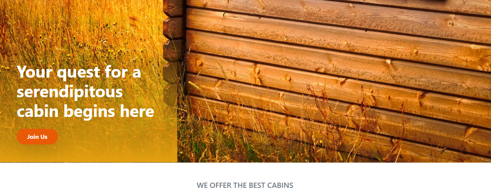

# Cabin Quest

- This is the frontend part for the capstone project of Microverse main technical curriculum.
  This is a cabin finder or locator app where users are able to see a list of different types of cabins and can add them to their favourites. 

 ### Main page

## Live Demo

- [Project Link](https://cabinquest.herokuapp.com/)

## Main Features

- A proper authentication system has been implemented using JWT.
- Users can sign up and sign in to the app.
- User can see list of cabins listed.
- User can see details of cabins and they can add them to their favourites.
- User can add, update and delete their favourites.

## API

- The backend API for this project can be found [here](https://github.com/SamArsanios/cabin-quest-api).

## Built with

- React
- Redux

## Getting Started

- Clone the repo `git@github.com:SamArsanios/cabin-quest.git`
- cd `into` the project
- Run `npm install` to install dependencies
- On the terminal run `npm start` open up the live server
- To run tests write `npm test` on the terminal

## Author

👤 **Samson Kibrom**

- Github: [@SamArsanios](https://github.com/SamArsanios)
- Twitter: [@SamArsanios](https://twitter.com/SamArsanios)
- Linkedin: [@Samson](https://www.linkedin.com/in/samson-kibrom)

## 🤝 Contributing

Contributions, issues and feature requests are welcome!

Feel free to check the [issues page](issues/).

## Show your support

Give a ⭐️ if you like this project!

## 👏 Acknowledgements

- [Microverse](issues/)
- All the images of cabins used in this app are taken from [pexels](https://www.pexels.com/) and belong to the respective owners.
- [Alexey Savitskiy](https://www.behance.net/alexey_savitskiy)

## 📝 License
MIT License
